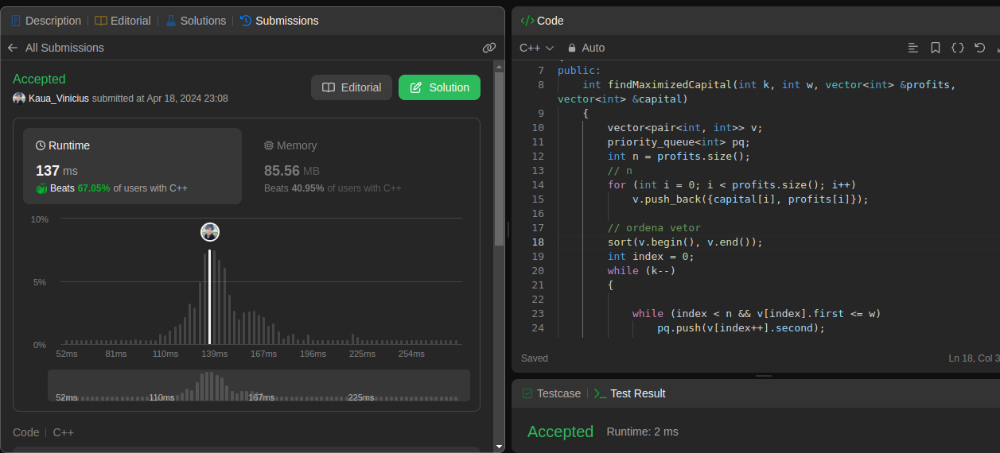
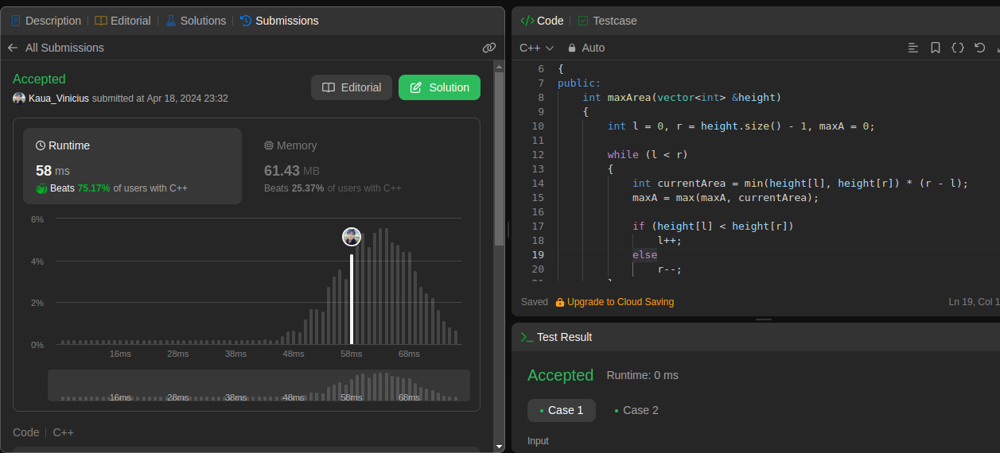

**!! Atenção: Renomeie o seu repositório para (Tema)_(NomeDoProjeto). !!** 

Temas:
 - Grafos1
 - Grafos2
 - PD
 - D&C
 - Greed
 - Final 
 
 **!! *Não coloque os nomes dos alunos no título do repositório*. Exemplo de título correto: Grafos2_Labirinto-do-Minotauro !!**
 
 (Apague essa seção)

# Greedy_JuizOnline

**Número da Lista**: 3<br>
**Conteúdo da Disciplina**: Greedy<br>

## Alunos

|Matrícula | Aluno |
| -- | -- |
| 21/1029399  |  Kauã Vinícius |
| 18/0030736  |  Carla de Araújo|

## Sobre 
Este repositório tem como objetivo a realização de exercícios de grafos do site [leetcode](https://leetcode.com/), seguem os exercícios solucionados com seus respectivos vídeos:

1 - [IPO](https://leetcode.com/problems/ipo/): Hard. [Vídeo](https://youtu.be/sA5PfNm9WOg)
</br>
2 - [Container With Most Water](https://leetcode.com/problems/container-with-most-water/description/): Medium [Vídeo](https://youtu.be/Ob4qoMHnsxM)
</br>
3 - [](): Medium. [Vídeo]()
</br>
4 - [](): Medium. [Vídeo]()

## Screenshots
As imagens 1 à 4 evidenciam as screenshots dos códigos que foram aceitos pelo site:

##### 1 - IPO


<div style="text-align: center">
<p> Imagem 1: Código aceito primeiro exercício (Fonte: Autor, 2024).</p>
</div>

##### 2 - Container With Most Water


<div style="text-align: center">
<p> Imagem 2: Código aceito segundo exercício (Fonte: Autor, 2024).</p>
</div>

##### 3 - 


<div style="text-align: center">
<p> Imagem 3: Código aceito terceiro exercício (Fonte: Autor, 2024).</p>
</div>

##### 4 - 


<div style="text-align: center">
<p> Imagem 4: Código aceito quarto exercício (Fonte: Autor, 2024).</p>
</div>

## Instalação 
**Linguagem**: C++ e Python<br>

Para os códigos python, execute:

```
python <nome do arquivo>
```

Para os códigos em c++, execute:

```
g++ -o <nomedoarquivo>.exe ./<nomedoarquivo>.cpp